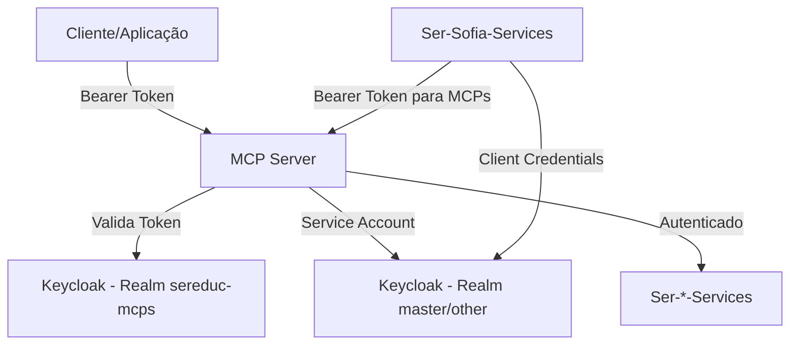

# Autenticação com Keycloak nos MCPs SerEduc

Este documento explica como funciona a autenticação com Keycloak nos servidores MCP (Model Context Protocol) do sistema SerEduc.

## Visão Geral

O sistema SerEduc utiliza dois fluxos de autenticação com Keycloak:

1. **Validação de Tokens OAuth** - Para autenticar requisições recebidas pelos MCPs
2. **Service Account (Client Credentials)** - Para comunicação entre serviços internos

## Arquitetura de Autenticação



## 1. Validação de Tokens OAuth (Bearer Tokens)

### Como Funciona

Os MCPs recebem tokens Bearer JWT que são validados contra o Keycloak para autenticar as requisições.

### Realm e Cliente

- **Realm**: `sereduc-mcps`
- **Client ID**: `ser-mcp-client`
- **Algoritmo**: RS256 (RSA com SHA-256)

### Configuração

```python
# config.py
class Settings(BaseSettings):
    # Keycloak OAuth configuration (para validação de tokens recebidos)
    keycloak_url: str = "http://localhost:8080"
    keycloak_realm: str = "sereduc-mcps"
    keycloak_client_id: str = "ser-mcp-client"
```

### Processo de Validação

1. **Extração do Token**: O middleware extrai o token do header `Authorization: Bearer <token>`

2. **Busca das Chaves JWKS**: O serviço busca as chaves públicas do Keycloak:

   ```
   GET {keycloak_url}/realms/{realm}/protocol/openid-connect/certs
   ```

3. **Validação JWT**: O token é validado usando:
   - **Assinatura**: Verificada com a chave pública RSA
   - **Issuer**: `{keycloak_url}/realms/{realm}`
   - **Audience**: `ser-mcp-client` (com fallback se não presente)
   - **Expiração**: Token não pode estar expirado
   - **Algoritmo**: Deve ser RS256

4. **Cache**: As chaves JWKS são cached para melhor performance

### Implementação

```python
# app/services/keycloak_oauth_service.py
class KeycloakOAuthService:
    async def validate_token(self, token: str) -> bool:
        """Valida token OAuth do Keycloak"""
        # 1. Busca JWKS
        jwks = await self.get_jwks()

        # 2. Extrai key ID do header
        unverified_header = jwt.get_unverified_header(token)
        kid = unverified_header.get("kid")

        # 3. Encontra a chave correspondente
        key = None
        for jwk in jwks.get("keys", []):
            if jwk.get("kid") == kid:
                key = jwk
                break

        # 4. Valida e decodifica o token
        payload = jwt.decode(
            token,
            key,
            algorithms=[ALGORITHMS.RS256],
            audience=self.client_id,
            issuer=f"{self.keycloak_url}/realms/{self.realm}",
            options={
                "verify_signature": True,
                "verify_aud": True,  # Com fallback para False
                "verify_iss": True,
                "verify_exp": True,
            }
        )
        return True
```

### Middleware de Autenticação

```python
# app/middleware/auth_middleware.py
class BearerTokenMiddleware(BaseHTTPMiddleware):
    """Middleware para validar tokens Bearer via Keycloak OAuth"""

    async def dispatch(self, request: Request, call_next: Callable) -> Response:
        # Endpoints públicos (sem autenticação)
        if request.url.path in ["/health", "/mcp/info"] or \
           (request.url.path == "/mcp" and request.method == "GET"):
            return await call_next(request)

        # Extrai Bearer token
        auth_header = request.headers.get("Authorization", "")
        if not auth_header.startswith("Bearer "):
            return 401_UNAUTHORIZED

        token = auth_header[7:].strip()

        # Valida token
        is_valid = await self.keycloak_oauth_service.validate_token(token)
        if not is_valid:
            return 401_UNAUTHORIZED

        # Armazena token validado no request
        request.state.oauth_token = token
        request.state.authenticated = True

        return await call_next(request)
```

## 2. Service Account (Client Credentials)

### Como Funciona

Para comunicação entre serviços, é usado o fluxo OAuth2 Client Credentials (service account) para obter tokens de acesso.

### Configuração

```python
# ser-sofia-services/config.py
class Settings(BaseSettings):
    # Keycloak OAuth for MCPs
    mcp_keycloak_realm: str = "sereduc-mcps"
    mcp_keycloak_client_id: str = "ser-mcp-client"
    mcp_keycloak_client_secret: str = ""
    mcp_keycloak_scope: Optional[str] = None

    @property
    def mcp_keycloak_token_url(self) -> str:
        """Build Keycloak token URL for MCPs."""
        return f"{self.keycloak_url}/realms/{self.mcp_keycloak_realm}/protocol/openid-connect/token"
```

### Implementação

```python
# ser-sofia-services/app/auth/keycloak_token_manager.py
class KeycloakTokenManager:
    """Client Credentials token manager com cache e refresh"""

    def __init__(self, token_url: str, client_id: str, client_secret: str):
        self.token_url = token_url
        self.client_id = client_id
        self.client_secret = client_secret
        self._token: Optional[AccessToken] = None

    async def get_access_token(self) -> str:
        """Obtém token de acesso, usando cache se válido"""
        if self._token and not self._is_token_expired():
            return self._token.value

        return await self._fetch_new_token()

    async def _fetch_new_token(self) -> str:
        """Busca novo token via Client Credentials flow"""
        data = {
            "grant_type": "client_credentials",
            "client_id": self.client_id,
            "client_secret": self.client_secret,
        }

        if self.scope:
            data["scope"] = self.scope

        async with httpx.AsyncClient() as client:
            response = await client.post(self.token_url, data=data)
            response.raise_for_status()

            token_data = response.json()
            expires_in = token_data.get("expires_in", 300)
            expires_at = time.time() + expires_in - 30  # Buffer de 30s

            self._token = AccessToken(
                value=token_data["access_token"],
                expires_at=expires_at
            )

            return self._token.value
```

## 3. Configuração do Keycloak

### Realms Necessários

1. **sereduc-mcps** - Para validação de tokens dos MCPs
2. **master** ou outro realm - Para comunicação entre serviços

### Clientes Keycloak

#### Cliente para MCPs - `ser-mcp-client`

**Configurações básicas:**

- **Client ID**: `ser-mcp-client`
- **Client Protocol**: `openid-connect`
- **Access Type**: `public` ou `confidential`

**Configurações OAuth:**

- **Standard Flow Enabled**: `true`
- **Direct Access Grants Enabled**: `true`
- **Service Accounts Enabled**: `true` (se confidential)

**Configurações JWT:**

- **Use Refresh Tokens**: `true`
- **Access Token Lifespan**: Configurar conforme necessário (ex: 1h)

#### Cliente para Serviços - `ser-api-client`

**Configurações básicas:**

- **Client ID**: `ser-api-client`
- **Access Type**: `confidential`
- **Service Accounts Enabled**: `true`

## 4. Variáveis de Ambiente

### MCPs (ser-aluno-mcp, ser-utils-mcp)

```bash
# Validação de tokens OAuth recebidos
KEYCLOAK_URL=http://localhost:8080
KEYCLOAK_REALM=sereduc-mcps
KEYCLOAK_CLIENT_ID=ser-mcp-client

# Comunicação com outros serviços (opcional, fallback para valores acima)
KEYCLOAK_SERVICES_URL=http://localhost:8080
KEYCLOAK_SERVICES_REALM=master
KEYCLOAK_SERVICES_CLIENT_ID=ser-api-client
KEYCLOAK_SERVICES_APP_USER=service-user
KEYCLOAK_SERVICES_APP_PASSWORD=password
```

### Ser-Sofia-Services

```bash
# Validação de tokens JWT
KEYCLOAK_URL=http://keycloak:8080
KEYCLOAK_REALM=master
KEYCLOAK_CLIENT_ID=ser-api-client
KEYCLOAK_APP_USER=wshub
KEYCLOAK_APP_PASSWORD=Teste@21

# Cliente para comunicação com MCPs
MCP_KEYCLOAK_REALM=sereduc-mcps
MCP_KEYCLOAK_CLIENT_ID=ser-mcp-client
MCP_KEYCLOAK_CLIENT_SECRET=your-client-secret
```

## 5. Fluxo Completo

### Requisição de Cliente Externo

1. Cliente obtém token do Keycloak (realm `sereduc-mcps`)
2. Cliente faz requisição ao MCP com `Authorization: Bearer <token>`
3. MCP valida token contra Keycloak
4. Se válido, MCP processa requisição
5. Se MCP precisa chamar outros serviços, usa service account

### Comunicação Ser-Sofia → MCP

1. Ser-Sofia obtém token usando Client Credentials
2. Ser-Sofia faz requisição ao MCP com token
3. MCP valida token e processa requisição

## 6. Monitoramento e Logs

### Logs de Autenticação

Os serviços logam eventos de autenticação:

```python
logger.warning(f"Invalid OAuth token from {request.client.host}")
logger.debug(f"Token validated successfully for client: {payload.get('azp')}")
```

### Métricas Importantes

- Taxa de tokens inválidos
- Tempo de resposta do Keycloak
- Cache hits/misses das chaves JWKS
- Renovação de tokens service account

## 7. Troubleshooting

### Problemas Comuns

1. **Token Inválido**
   - Verificar se token não expirou
   - Validar issuer e audience
   - Verificar se chaves JWKS estão atualizadas

2. **Falha na Comunicação com Keycloak**
   - Verificar conectividade de rede
   - Validar URLs e portas
   - Verificar certificados SSL em produção

3. **Client Credentials Falhando**
   - Verificar client_id e client_secret
   - Validar permissões do service account
   - Verificar realm correto

### Debug

Para debug, ative logs detalhados:

```python
logging.getLogger("app.services.keycloak_oauth_service").setLevel(logging.DEBUG)
```

## 8. Considerações de Segurança

1. **Secrets**: Nunca commitar client secrets no código
2. **HTTPS**: Sempre usar HTTPS em produção
3. **Token Lifetime**: Configurar lifetime adequado para tokens
4. **Rate Limiting**: Implementar rate limiting nos endpoints
5. **Audit**: Manter logs de auditoria de autenticação
6. **Network**: Proteger comunicação entre serviços (VPN/firewall)
